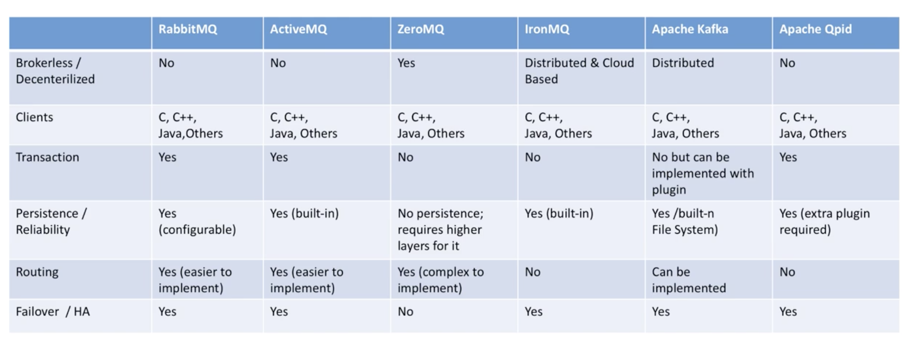

# 4 Actors of Messaging with RabbitMQ
- producer - exchange - (route) - queue - consumer

# Exchanges
- Actual AMQP elements where messages are sent at first
- Takes a message and routes it into one or more queues
- Routing algorithm decides where to send messages from exchange
- Routing algorithms depends on the exchange type and rules called "bindings"
- Bindings are simply used to bind exchanges to queues for message delivery

## Four exchange types
- Direct 
- Fanout
- Topic
- Headers

# Queue
- A cire element in any MQ protocol especially for RabbitMQ
- Messages are routed to queues from exchanges
- Queues are final destinations in RabbitMQ before being received by subscribers
- Routing algorithms depends on the exchange type and rules called "bindings"
- Bindings are simply used to bind exchanges to queues for message delivery

## Properties of a Queue
- Name
- Durable
- Exclusive
- Auto Delete 

# Topics
- Subject part of the message
- Defined as routing_key for message grouping
- Special formatting for better use:
    - app.logs.error
- Optional parameters for message exchange
- You can send and receive messages without any topic information 
- Topic Exchanges are defined using Topics for message delivery
# Bindings
- Rules that exchanges use to route messages to queues
- To instruct an exchange E to route messages to a queue K, K has to be bound to E
- May have an optional routing key attribute used by some exchange types
- So the routing key acts like a filter
- Binding Analogy:
    - Queue is like your destination in Istanbul city of Turkey
    - Exchange is like Ataturk airport in Istanbul city
    - Bindings are routes from Ataturk to your destination. There can be zero or many ways to reach it
- If message cannot be routed to any queue, it is either dropped or returned to the publisher, depending on message attributes the publisher has set 

# RabbitMQ vs Others
